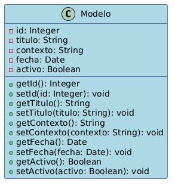
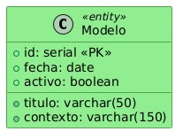

# Proyecto Tareas con Postgres y JDBC

Este proyecto fue creado con el propósito de realizar un gestor de tareas, realizado mediante Java. Para ello, se tuvo que crear el diseño de lo que sería el modelo a seguir con sus parametros, estos deberán de verse ajustados a su desfase con respecto a Postgres, ya que el tipo de datos es diferente entre ambos lenguajes.

Este trabajo está realizado por:

Carmen Gordo

Jesús Jímenez

## Diseño del modelo, con desfase en Java a Postgres

- Id: Int -> Intenger, pero al ser con autoincremento, se pondría "serial"
- Título: String -> Varchar(50)
- Contenido: String -> Varchar(150)
- Fecha: date -> date
- Activo: boolean -> boolean

## Diseño de imagen UML
 Java
 Postgres

## Lenguajes usados

**Client:** Java

**Server:** Postgres

## Webgrafía

- [Tipos de datos en Postgress](https://www.todopostgresql.com/postgresql-data-types-los-tipos-de-datos-mas-utilizados/)
- [BD en Java mediante JDBC](https://adictosaltrabajo.com/2011/02/25/tutorial-basico-jdbc/)
- [Creación del Read.me](https://readme.so/es/editor)

